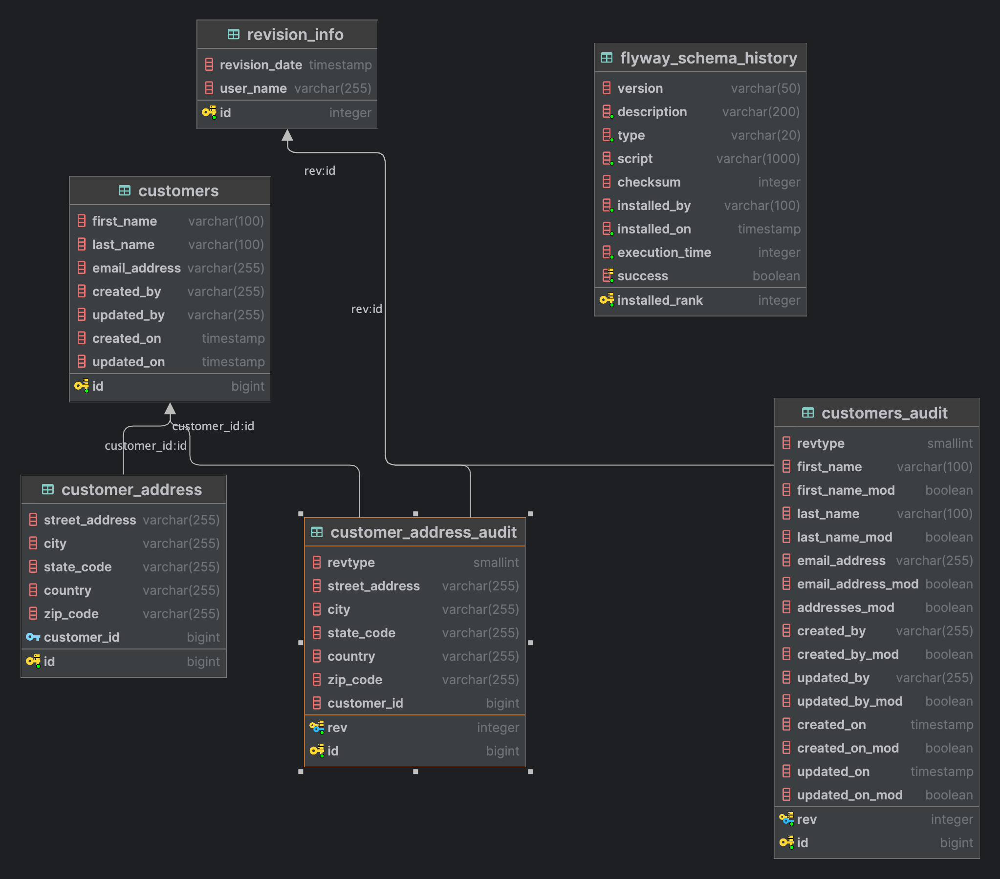

# audit-trail

Simple Restful API with Audit Trail using Hibernate Envers

## Run application

```bash
docker compose up -d
```

## Stop application

```bash
docker compose down
```

# Application Schema


## Add Customer
```bash
curl --location 'localhost:8080/customers' \
--header 'Content-Type: application/json' \
--data-raw '{
    "id": 1,
    "firstName": "Troy",
    "lastName": "Hahn",
    "email": "troy.hahn@gmail.com"
}'
```
Response 201

## Update Customer
```bash
curl --location --request PUT 'localhost:8080/customers/1' \
--header 'Content-Type: application/json' \
--data-raw ' {
      "firstName": "Theresia",
      "lastName": "Macejkovic",
      "email": "thres.mac@gmail.com",
      "customerAddress": [
        {
          "streetAddress": "942 Walker Street",
          "city": "Risaberg",
          "stateCode": "WV",
          "country": "USA",
          "zipCode": "88742"
        }
      ]
    }'
```
Response 200
```json
{
    "firstName": "Theresia",
    "lastName": "Macejkovic",
    "customerAddress": null,
    "email": "thres.mac@gmail.com"
}
```

## Delete Customer
```bash
curl --location --request DELETE 'localhost:8080/customers/1'
```
Response 204

## Get Customer Revision
```bash
curl --location 'localhost:8080/customers/1/revisions'
```
Response 200
```json
[
    {
        "revision": {
            "id": 1,
            "date": "2024-07-28T21:56:40.713+00:00",
            "userName": "System"
        }
    },
    {
        "revision": {
            "id": 2,
            "date": "2024-07-28T22:08:06.171+00:00",
            "userName": "System"
        }
    }
]
```

## Get Customer Revision with changes
```bash
curl --location 'localhost:8080/customers/1/revisions?fetch=true'
```
Response 200
```json
[
  {
    "revisionType": "ADD",
    "changes": [],
    "entity": {
      "id": 1,
      "firstName": "Troy",
      "lastName": "Hahn",
      "emailAddress": "troy.hahn@gmail.com",
      "addresses": [],
      "createdBy": "System",
      "updatedBy": "System",
      "createdOn": "2024-07-28T21:56:40.693+00:00",
      "updatedOn": "2024-07-28T21:56:40.693+00:00"
    },
    "revision": {
      "id": 1,
      "date": "2024-07-28T21:56:40.713+00:00",
      "userName": "System"
    }
  },
  {
    "revisionType": "MOD",
    "changes": [
      "firstName",
      "lastName",
      "addresses",
      "emailAddress",
      "updatedOn"
    ],
    "entity": {
      "id": 1,
      "firstName": "Theresia",
      "lastName": "Macejkovic",
      "emailAddress": "thres.mac@gmail.com",
      "addresses": [
        {
          "id": 1,
          "streetAddress": "942 Walker Street",
          "city": "Risaberg",
          "stateCode": "WV",
          "country": "USA",
          "zipCode": "88742",
          "customerId": 1
        }
      ],
      "createdBy": "System",
      "updatedBy": "System",
      "createdOn": "2024-07-28T21:56:40.693+00:00",
      "updatedOn": "2024-07-28T22:08:06.165+00:00"
    },
    "revision": {
      "id": 2,
      "date": "2024-07-28T22:08:06.171+00:00",
      "userName": "System"
    }
  },
  {
    "revisionType": "DEL",
    "changes": [],
    "entity": {
      "id": 1,
      "firstName": null,
      "lastName": null,
      "emailAddress": null,
      "addresses": [],
      "createdBy": null,
      "updatedBy": null,
      "createdOn": null,
      "updatedOn": null
    },
    "revision": {
      "id": 3,
      "date": "2024-07-28T22:12:02.149+00:00",
      "userName": "System"
    }
  }
]
```
